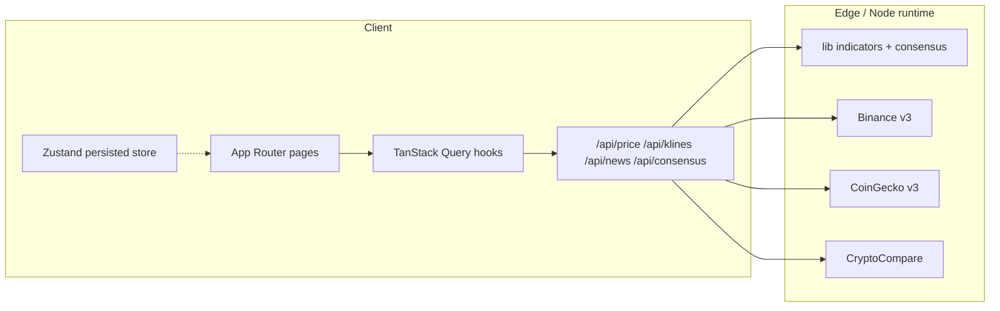

# BTC Terminal

Terminal de análisis técnico de Bitcoin en tiempo real, construido con Next.js 15
(App Router), TypeScript estricto, Tailwind CSS 4 y Chart.js 4. Migración a
producción del MVP HTML monolítico (`reference/btc_live_terminal.html`).

Cinco secciones (§01-§05):

1. **Consenso técnico** · veredicto de 11 indicadores → COMPRAR / VENDER / MANTENER + niveles operativos.
2. **Señales multi-timeframe** · 1H · 4H · 1D · 1W, cada uno con score y drivers.
3. **Indicadores clave** · RSI, MACD, EMA 50, EMA 200.
4. **Charts** · BTC + EMA50/EMA200 con selector de timeframe + RSI(14).
5. **Feed de noticias** · CryptoCompare con clasificador keyword-based de sentiment.

## Quick start

```bash
pnpm install
cp .env.example .env.local        # opcional
pnpm dev                          # http://localhost:3000
```

## Comandos

| Comando | Acción |
| --- | --- |
| `pnpm dev` | Servidor dev (Turbopack) en `:3000` |
| `pnpm build` | Build de producción |
| `pnpm start` | Servir el build |
| `pnpm test` | Vitest (indicadores + consenso) |
| `pnpm lint` | ESLint |
| `pnpm typecheck` | `tsc --noEmit` |
| `pnpm format` | Prettier |

## Stack & arquitectura

Next.js 15 App Router + React Server Components donde no se requiere estado,
con un capa propia de API routes (`/api/price`, `/api/klines/[interval]`,
`/api/news`, `/api/consensus`) que cachean respuestas de Binance / CoinGecko /
CryptoCompare en el edge. Toda la lógica de indicadores y consenso vive en
`lib/` como funciones puras testeadas con Vitest; el cliente consume vía
TanStack Query con polling adaptativo, y Zustand persiste preferencias UI
(timeframe de chart) en `localStorage`. Estética terminal Bloomberg dark mode
con IBM Plex Mono + Newsreader.



## Variables de entorno

Todas opcionales — la app funciona sin keys (rate limits más estrictos):

```env
COINGECKO_API_KEY=        # demo key opcional
CRYPTOCOMPARE_API_KEY=    # opcional
KV_REST_API_URL=          # reservado para histórico de veredictos
KV_REST_API_TOKEN=
```

Copia `.env.example` a `.env.local` y rellena lo que necesites.

## Estructura

```
app/                    # Routes + API routes
components/terminal/    # Componentes de la UI (TopBar, VerdictPanel, ...)
components/providers/   # QueryProvider
hooks/                  # usePrice, useKlines, useNews, useConsensus
lib/indicators/         # 11 indicadores como funciones puras
lib/consensus.ts        # Motor de veredicto
lib/signals.ts          # Señales por timeframe
lib/news-sentiment.ts   # Clasificador keyword-based
lib/api-clients/        # binance / coingecko / cryptocompare
stores/ui-store.ts      # Zustand persistido
tests/indicators/       # Vitest
reference/              # HTML MVP original (no se compila)
```

## Deploy a Vercel

1. Push del branch a GitHub.
2. En Vercel: New Project → importar el repo.
3. Framework preset: **Next.js** (auto-detectado vía `vercel.json`).
4. Variables de entorno: copiar las que se necesiten desde `.env.example`.
5. Habilitar Vercel Analytics + Speed Insights (opcional).
6. Branch protection en `main`.

`vercel --prod` también funciona desde local si tienes el CLI autenticado.

## Disclaimer

Esta plataforma proporciona análisis técnico automatizado con fines
exclusivamente informativos. **No constituye asesoramiento financiero,
recomendación de inversión, ni invitación a operar.** Las señales generadas son
agregaciones técnicas que pueden fallar. El usuario es el único responsable de
sus decisiones de inversión. Ver `/disclaimer` para el texto completo.

## Licencia

Privado. © Alexis Espejo.
